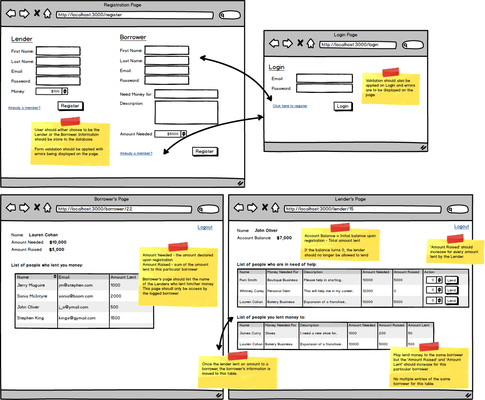

# Application test for Coding Dojo

## Instructions

Build a login based web for a system to loan/borrow money. This system is based on 2 kind of roles:
- Lenders
- Borrowers

Where Borrowers at the moment of register should load a description for what they need the money and the amount and next they can check in a Homepage who has lent and how much. By the 
other way Lenders register the amount of money available to lend at the moment of the registration and in their homepage they can check the borrowers that still need a loan and their details and the users(borrowers) that have received a loan from hte user.

There's some annotations given:

## Propose Solution

Because the application position includes mastery on Python 3.7/HTML/CSS/JS/Django 3.2 I decided to use Django as backend and 
template render using vanilla HTML/CSS/JS for the web. Additionally, I will use some frameworks and libraries to manage 
the objects/models in the request as django-rest-framework and libraries as bootstrap for a better looking 😎.

The final list of libraries can be check on the [requirements file](requirements.txt).

## Results (Soon)